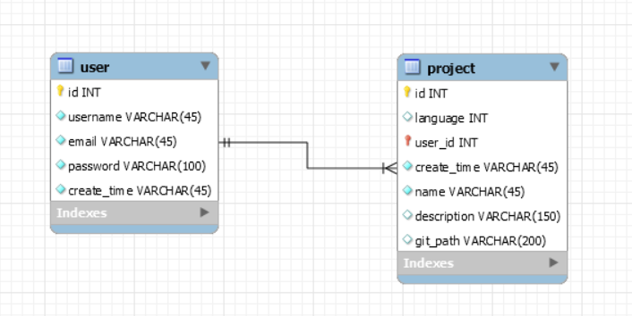

# GO-ONLINE 数据库说明

## [Script](files/db/db.sql)

## Image

## 用户表

|字段|说明|
|-|-|
|id|用户在数据库中的唯一id|
|username|用户名，初始用户名由系统自动生成|
|email|用户邮箱，用以通知和登录|
|password|加密后的用户密码|
|create_time|用户的创建时间|

## 项目表

|字段|说明|
|-|-|
|id|项目在数据库中的唯一标识|
|language|项目所使用的编程语言，具体对应表见[数据结构定义文档](02_数据结构定义文档.md)|
|user_id|外键，指明该项目所属的用户|
|name|项目名|
|create_time|项目的创建时间|