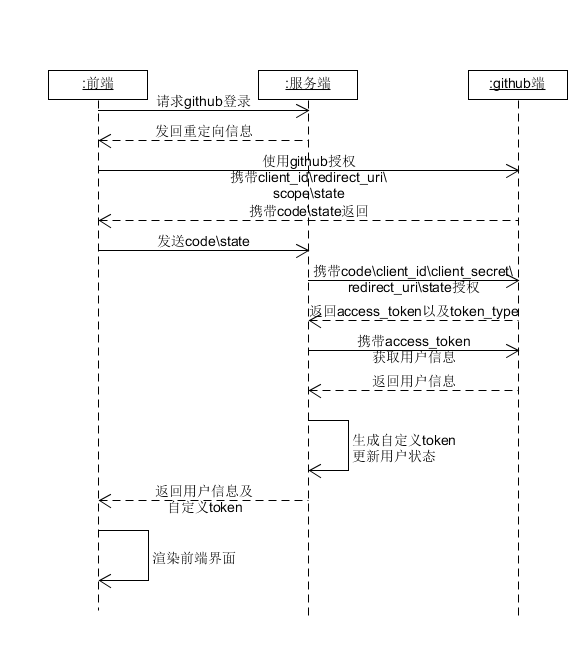

# go-online 技术说明文档

## 数据库

- Project表

  project_name：项目名称

  project_id：项目id，系统自增，项目的全局唯一标识

  userid：用户id，外键，指明该项目的用户编号

  language：项目的主语言，具体见下面的语言对照表

## 接口

由于接口的参数返回值和数据库相同，因此不再单独进行说明

## 数据结构定义

对于一个用户，涉及到的变量有以下内容：

- `home`

  家目录，定义在宿主机，即文件服务器中的位置为`/home/{userid}`，其中`userid`为用户ID

- `environment`

  - `GOPATH`

    go语言包的所在目录，指的是容器内部包的位置为`/go`，默认即可

- `mount_point`

  挂载点，即宿主机内部的文件夹以及需要在容器中挂载的位置

- `host_project_dir`

  宿主机项目目录，指的是宿主机中，特定项目的位置为`/home/{username}/go/src/github.com/{github_username}/{project_name}`，其中，`project_name`为项目名，`github_username`为用户链接上的github用户名，若用户并未绑定github账户，则使用创建项目时指定的参数

- `container_project_dir`

  容器内项目目录，为`/root/go/src/github.com/{github_username}/{project_name}`

- `pwd`

  用户当前所在目录，即用户在容器中所在的目录为`{container_project_dir}/{currentpath}`，`currectpath`指的是用户当前相对项目根目录的路径，由服务端记录并维护

## 用户场景描述

### 用户登录(从未授权情况)

- 顺序图

  

- 详细说明

  1. 前端向后台/auth发送一个GET请求，后台检测传回的数据是否包含有code和state信息，若没有，则继续；若有，跳转至第5步

  1. 后台向前端发送一个重定向请求，其中包含的信息见api文档，前端跳转到授权页面

  1. 用户完成授权，第三方页面携带code和state重定向至参数中指定的界面

  1. 前端读取第三方返回的信息，并携带信息向后台/auth发送请求

  1. 后台根据前端发来信息向github服务器换取access_token

  1. 后台根据获得的信息，创建用户条目，生成用户token，并将用户名等相关信息传回前端

  1. 前端获得用户基本信息和token后，渲染登录界面，进行下一步操作